# Implementation of Digital Image Process(Yudong Guo) Assignment 2 - DIP with PyTorch

**Name:** Zijian Zhang(张子健)

**Student ID:** SA25001083

该仓库包含中国科学技术大学数学科学学院数字图像处理（MATH6420P.01）课程的作业2（DIP with PyTorch）的实现过程以及实验结果。主要实现了Poisson图像编辑与图像的语义分割两部分内容。

## 1. 图像Poisson编辑

### 1.1 基本思路
图像 Poisson 编辑的核心思想是：人类视觉系统对图像的二阶变化（即拉普拉斯算子提取的梯度或纹理）比对绝对的颜色强度更加敏感。因此，实现无缝融合的关键不是直接替换像素的颜色值，而是替换像素的“梯度”（即像素之间的变化趋势）。

**数学表达：** 希望在选定的闭合区域 $\Omega$ 内，求解一个未知函数 $f$（即最终融合的图像），使其内部的拉普拉斯特征（二阶梯度）完全等同于源图像 $g$ 的拉普拉斯特征。即满足方程：
  $$\Delta f = \Delta g$$

**边界约束：** 同时，必须强制在区域的边界 $\partial\Omega$ 上，融合图像的像素值严格等于目标背景图像 $f^*$ 的像素值。这就构成了一个带有 Dirichlet 边界条件的 Poisson 偏微分方程。通过求解该方程，源图像的纹理会被保留，而颜色和光照会根据背景边界自然地“渗透”和过渡，从而消除违和的接缝。

### 1.2 求解方法
在原论文中，求解上述带有不规则边界的 Poisson 方程，需要将其离散化，转化为一个极其庞大的稀疏对称正定线性方程组，并使用 Gauss-Seidel 迭代或多重网格法来求解。这种传统数值分析方法在构建稀疏矩阵时逻辑复杂，且难以直接利用现代硬件直接加速。

可以将传统的“解偏微分方程”问题，巧妙地转化为了“深度学习中的目标函数最小化（Loss Optimization）”问题，具体方法如下：

1. **自动求导与优化器：** 将待融合的图像作为一个可求导的 Tensor (`blended_img.requires_grad = True`)，直接利用深度学习中成熟的 Adam 优化器 (`torch.optim.Adam`) 通过反向传播来不断逼近最优解，避开手写复杂矩阵求解器的麻烦。
2. **GPU 并行加速：** 图像的求导和掩码操作均是高度并行的矩阵运算，PyTorch 可以将 Tensor 放进 GPU 计算，极大地提升了像素级优化的速度。

本实验代码在老师给出的模版的基础上，主要补充了以下两块核心内容：

#### 1.2.1 增加内容一：完成多边形掩码生成 (`create_mask_from_points`)
* **实现方法：** 引入了 `PIL.Image` 和 `ImageDraw`，通过创建一个全黑的灰度图画布，使用 `draw.polygon` 方法将用户框选的多边形顶点连线并填充为纯白色（255），最后将其转换为 Numpy 数组返回。
* **基本原理：** 这是一个计算几何与光栅化的过程。计算机需要一个二值矩阵（0 和 1）来严格区分哪些像素属于 Poisson 方程的求解域内部（$\Omega$），哪些属于无需修改的外部背景。PIL 底层的扫描线填充算法快速准确地完成了从“离散多边形顶点坐标”到“稠密像素级二值掩码（Mask）”的映射。

#### 1.2.2 增加内容二：完成拉普拉斯损失函数的计算 (`cal_laplacian_loss`)
* **实现方法：** 1. 定义了一个 $3 \times 3$ 的拉普拉斯卷积核，并扩展为 3 通道。
  2. 使用 `F.conv2d` 分别对前景图和当前融合图进行卷积，提取梯度。
  3. 将 Mask 扩展并转换为布尔索引 (`bool()`)，提取出掩码内部的梯度。
  4. 计算两者差值的平方和作为最终的 Loss。
* **基本原理：** 这是整个 Poisson 编辑的灵魂。在离散像素网格上，图像的拉普拉斯算子（$\Delta$）完美等价于图像与特定的 $3 \times 3$ 滤波器进行**空间卷积**。通过 `F.conv2d` 提取出源图和当前融合图的二阶特征后，利用均方误差（MSE）强迫两者在 Mask 内部极其相似。只要这个 Loss 降到足够低，数学上就等同于求出了 Poisson 方程 $\Delta f = \Delta g$ 的近似数值解。布尔掩码的精确索引则保证了优化过程绝对不会越界破坏背景的原始像素。

### 1.3 注意事项
整个运行的时间大约在3分钟左右，需要注意的是，除了monolisa中的两个图片（均为416×506像素）尺寸相同以外，剩下的两组图片尺寸各自不相同，equation中的两个图片尺寸分别为2812×1504像素和426×396像素，water中
两个图片尺寸分别为400×266像素和603×452像素，所以在代码中需要解决图片尺寸不一样的问题，不然在运行时可能会出现报错。

在传统的图像融合操作中，由于矩阵运算对维度的严格对齐要求，通常需要先通过裁剪、填充或缩放将前景与背景图像变换至同一尺寸。这不仅增加了额外的预处理开销，还可能引入插值伪影或大量无效的零填充计算。

本实验的算法通过引入布尔索引实现了异构尺寸图像特征的精准对齐与计算。具体步骤如下：

#### 1.3.1 独立生成原分辨率掩码
算法首先保持前景图像与背景图像各自的原始尺寸不变。在获取多边形顶点的相对平移坐标 `(dx, dy)` 后，分别在各自的图像尺寸空间内生成二值掩码：
* **前景掩码 (`foreground_mask`)**：尺寸为前景图的 $H_{fg} \times W_{fg}$。
* **背景掩码 (`background_mask`)**：尺寸为背景图的 $H_{bg} \times W_{bg}$。
尽管这两个掩码矩阵的全局维度完全不同，但由于背景掩码是由前景掩码纯平移生成的，二者内部包含的有效像素（值为 True 或 255 的点）的数量和拓扑结构是绝对一致的。

#### 1.3.2 基于布尔索引的降维特征提取
在分别利用 $3 \times 3$ 卷积核对前景图和背景图提取全局的拉普拉斯二阶特征（`fg_grad` 与 `blend_grad`）后，利用 PyTorch 的布尔索引特性，将高维张量精准过滤并展平为一维向量：
```python
fg_grad_masked = fg_grad[fg_mask_bool]
blend_grad_masked = blend_grad[bg_mask_bool]
```

通过以上步骤和方法来解决Foreground Image和Background Image尺寸不匹配的问题。

### 1.4 实验结果
在实验过程中需要和Assignment 1一样创建一个新的虚拟环境（Python版本一般选择3.9，3.10或者3.11），需要安装的库依赖如下：
```bash
source .venv/bin/activate
pip install torch torchvision numpy Pillow "gradio==4.44.1"
```

实验选定区域和实验过程图如下：
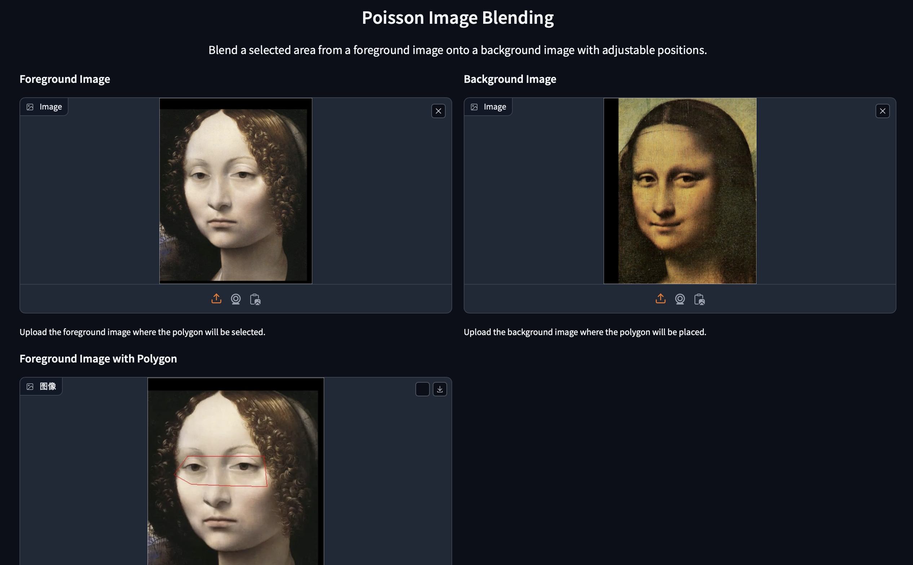
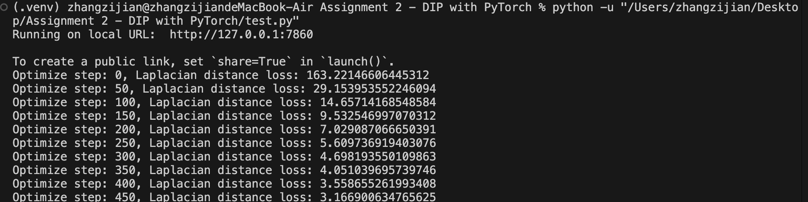
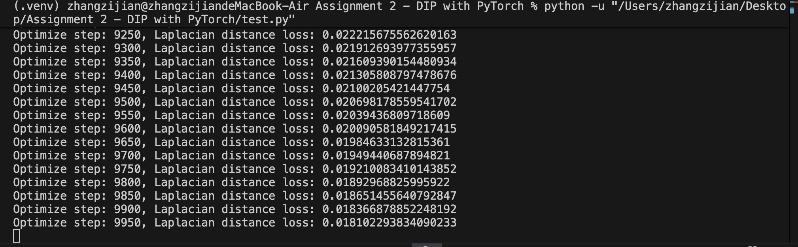

最终的实验结果如下（可以根据Horizontal Offset和Vertical Offset来使用调整选定多边形的位置参数）：
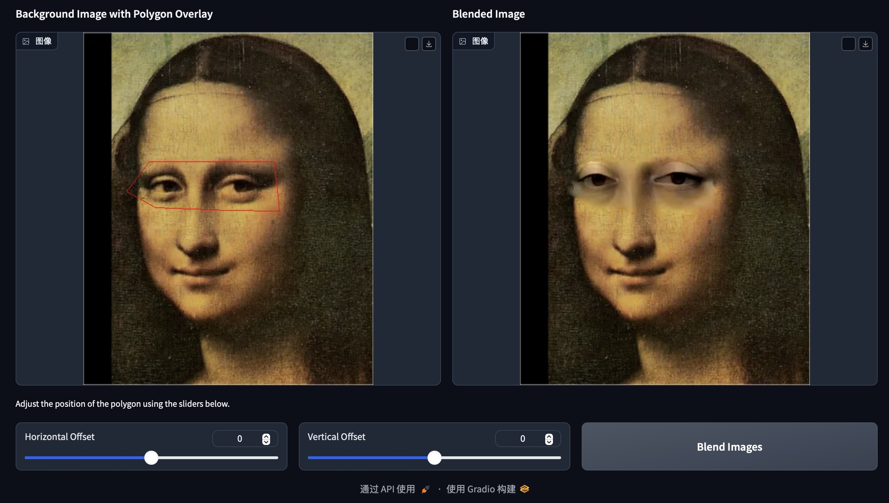
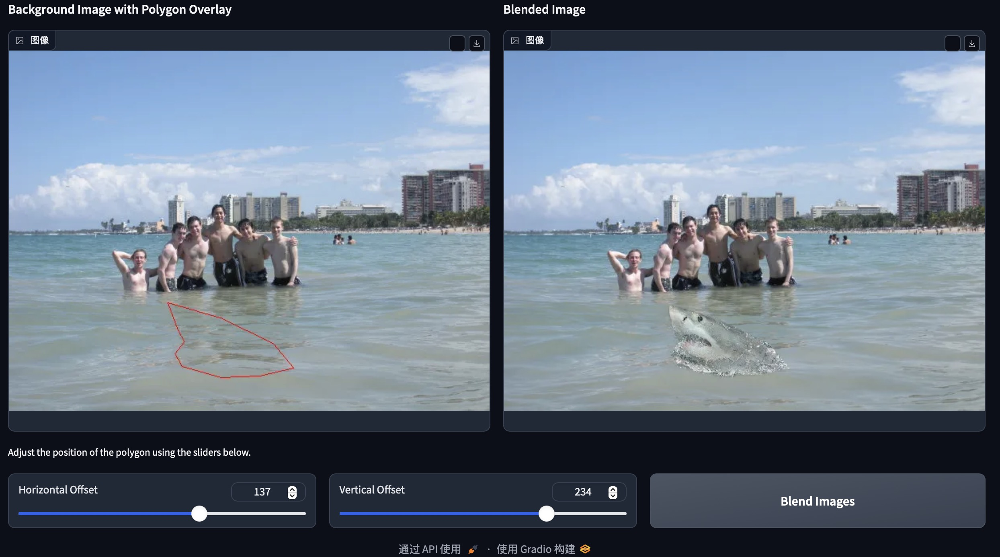
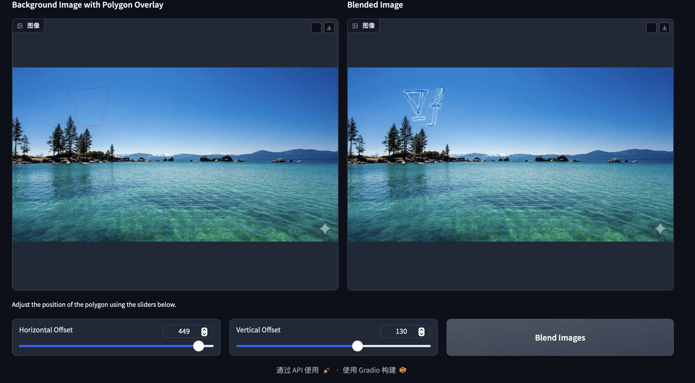
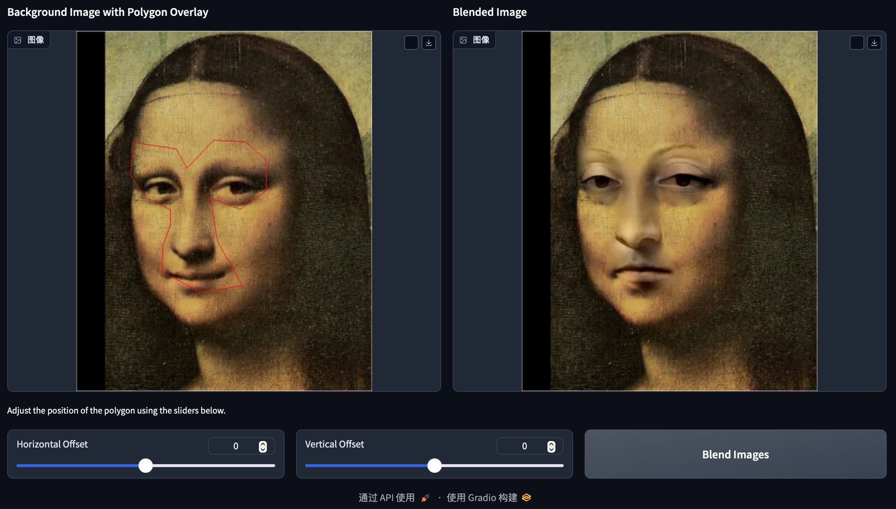

## 2.图像的语义分割

### 2.1 下载与环境依赖
在下载数据集时，需要针对Mac系统对download_facades_dataset.sh文件进行修改，需要将以下内容：
```bash
wget -N $URL -O $TAR_FILE
```
更换为Mac自带的`curl`命令：
```bash
curl -L $URL -o $TAR_FILE
```
下载后一共400张训练集图片，100张验证集图片和100张最终的测试集图片。

在实验过程中需要虚拟环境（Python版本选择了3.9.6），需要安装的库依赖如下：
```bash
source .venv/bin/activate
pip install opencv-python numpy torch
```

### 2.2 核心原理与模型架构
使用一个标准的全卷积自编码器对数据集进行训练。它完全由卷积层和转置卷积层构成，没有任何全连接层。这种设计的主要优点是平移不变性以及对输入尺寸的良好适应性。

整个网络分为三个核心部分：**编码器**、**隐空间** 和 **解码器**。

#### 2.2.1 编码器 - 特征提取与降维
编码器的任务是“压缩”输入图像，提取其核心特征。
* **下采样原理：** 代码中没有使用 MaxPooling 进行池化，而是使用了 `stride=2`（步长为2）的二维卷积 (`nn.Conv2d`)。这不仅能提取特征，还能让输出特征图的长宽尺寸直接减半。
* **维度变化：** 输入图像: $(3, 256, 256)$ 
    * Conv1: 尺寸减半，通道增加 $\to (8, 128, 128)$
    * Conv2: 尺寸减半，通道增加 $\to (16, 64, 64)$
    * Conv3: 尺寸减半，通道增加 $\to (32, 32, 32)$
* **辅助层：** 每一层都配合了批归一化 (`nn.BatchNorm2d`) 来加速收敛并防止过拟合，以及 `ReLU` 激活函数来引入非线性。

#### 2.2.2 隐空间 - 信息瓶颈
经过三次卷积后，数据到达了网络的最深层，即 `conv3` 的输出。
此时，原始的 $(3, 256, 256)$ 图像被高度压缩成了 $(32, 32, 32)$ 的特征图。这里包含了图像最核心的语义信息，被称为隐变量。

#### 2.2.3 解码器 - 图像重建
解码器的任务是根据隐空间的高度压缩信息，将其“还原”回原始图像的尺寸。
* **上采样原理：** 使用了转置卷积层 (`nn.ConvTranspose2d`)，设定 `stride=2`。这与编码器的操作正好相反，它的作用是将特征图的长宽尺寸翻倍。
* **维度变化：**
    * Deconv1: 尺寸翻倍，通道减少 $\to (16, 64, 64)$
    * Deconv2: 尺寸翻倍，通道减少 $\to (8, 128, 128)$
    * Deconv3: 尺寸翻倍，通道还原 $\to (3, 256, 256)$
* **输出处理：** 在最后一层 `deconv3` 中，网络没有使用 ReLU，而是使用了 **Sigmoid** 激活函数。这是因为 RGB 图像的归一化像素值通常在 $[0, 1]$ 之间，Sigmoid 可以将网络最终的输出严格映射并限制在这个合理区间内。

但是后来发现使用**Tanh**激活函数比较合理，在层数较深的网络中，由于每层都要乘以激活函数的导数，使用 Tanh 传递的梯度信号比 Sigmoid 强得多，能更有效地缓解梯度消失问题。在预处理时图像的范围在[-1,1],能有效与**Tanh**激活函数的范围相对应。

对原有的代码进行了以下3处的修改：

* 1.文件`train.py`中开启 Apple Silicon GPU (MPS) 加速，将`main()`函数中的：
```python
device = torch.device('cuda:0' if torch.cuda.is_available() else 'cpu')
```
修改为：
```python
if torch.backends.mps.is_available():
    device = torch.device('mps')
elif torch.cuda.is_available():
    device = torch.device('cuda:0')
else:
    device = torch.device('cpu')
```

* 2.在文件`train.py`中减小 Batch Size ，即将`main()`函数中的数据加载器：
```python
train_loader = DataLoader(train_dataset, batch_size=100, shuffle=True, num_workers=4)
```
修改为：
```python
train_loader = DataLoader(train_dataset, batch_size=16, shuffle=True, num_workers=2)
val_loader = DataLoader(val_dataset, batch_size=16, shuffle=False, num_workers=2)
```

* 3.修复 OpenCV 的颜色通道，OpenCV 默认读取图片的格式是 BGR（蓝绿红），但 PyTorch 和 Matplotlib 默认要求的都是 RGB（红绿蓝）。如果不转换，模型学到的颜色完全是反的。将`facades_dataset.py`中的：
```python
img_color_semantic = cv2.imread(img_name)
```
修改为：
```python
def __getitem__(self, idx):
        # Get the image filename
        img_name = self.image_filenames[idx]
        img_bgr = cv2.imread(img_name)
        
        # 必须把 BGR 转换成 RGB
        img_color_semantic = cv2.cvtColor(img_bgr, cv2.COLOR_BGR2RGB)
        
        # Convert the image to a PyTorch tensor
        image = torch.from_numpy(img_color_semantic).permute(2, 0, 1).float()/255.0 * 2.0 -1.0
        image_rgb = image[:, :, :256]
        image_semantic = image[:, :, 256:]
        return image_rgb, image_semantic
```
并且这个训练过程需要足够的内存，才能进行全部的300个epoch的训练轮次，在训练时如果使用内存较小的设备会导致程序内存溢出，进而导致设备关机。

### 2.3 训练过程与训练结果
在最初几轮训练中验证集的结果如下（为了方便观察训练效果，本文使用的验证集中的图片都是相同的），不太理想：
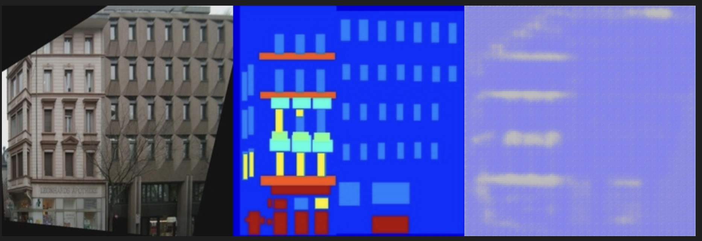
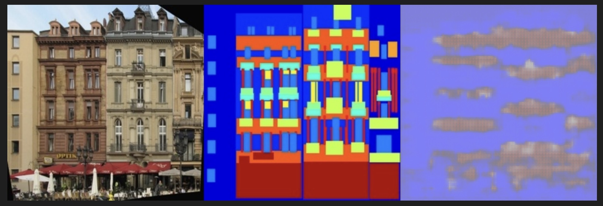
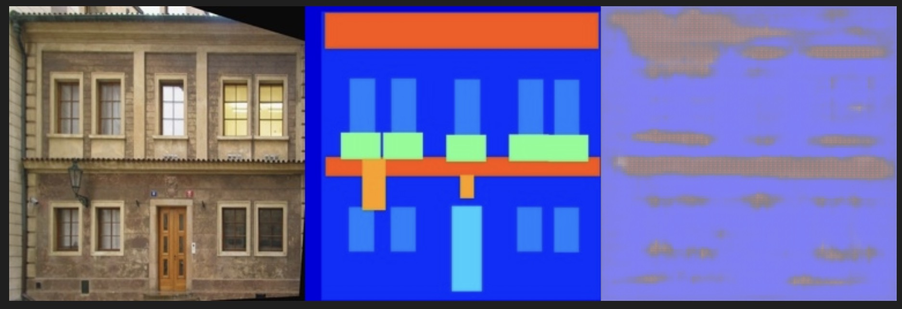
训练过程中的输出如下：
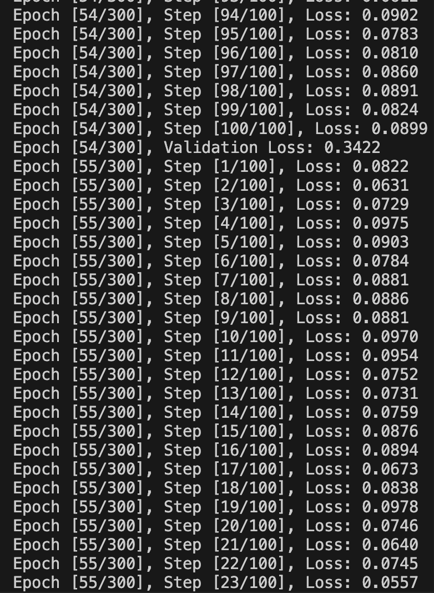

可以看出在训练到55/300个Epoch时会出现严重的**过拟合现象**，验证集的Loss值在
0.34左右，但是训练集的Loss已经降到0.1以下，这样的话后面的训练都失去了意义。此时查看训练集的结果如下：
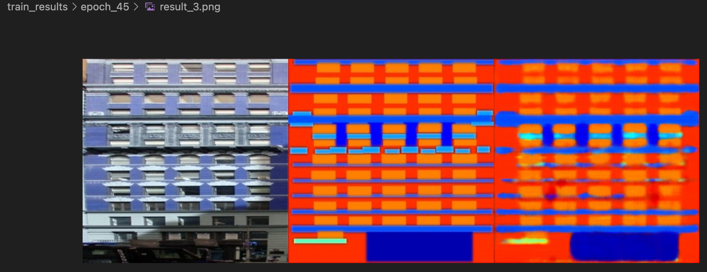
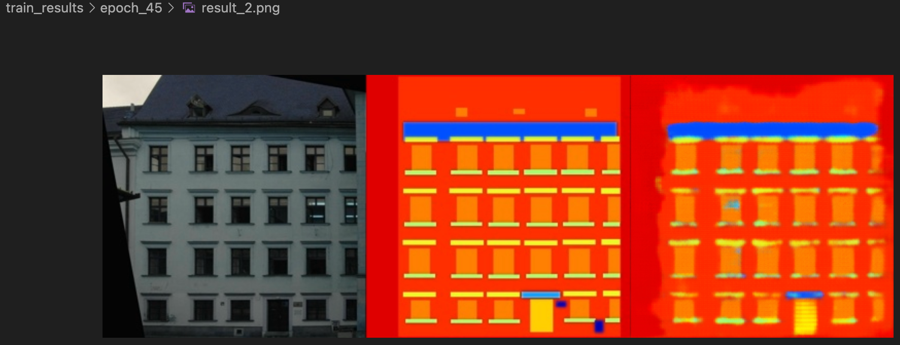
但是验证集的图片训练结果如下：
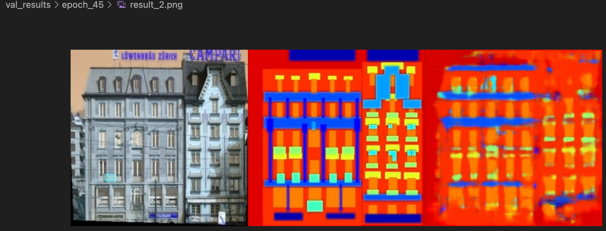
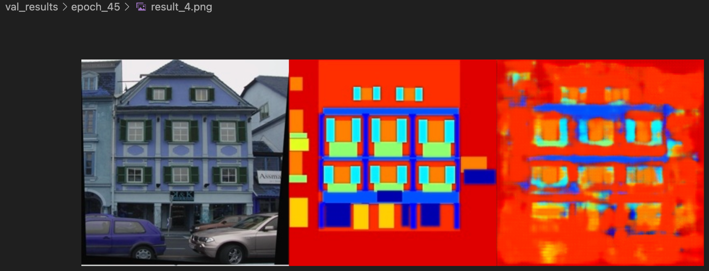
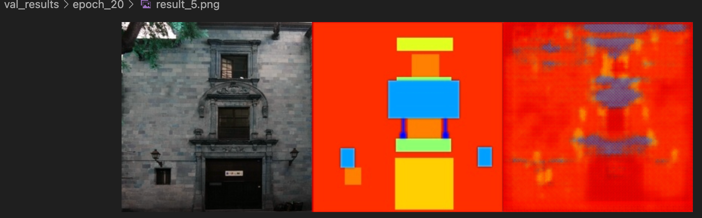

最终的训练效果不太理想。

### 2.4 改进方法
使用以下3种方法对整个训练过程进行改进：
### 2.4.1 增加数据集
增加`cityscapes`数据集，和`facades`数据集下载方式完全相同，其中`cityscapes`数据集包含2975张训练集图片和500张验证集图片，没有测试集图片。

增加`append_dataset.py`文件，将新下载的图片文件添加到`train_list.txt`和`val_list.txt`文件中去，扫描指定的新数据集目录，提取有效的图像文件路径，并在不破坏、不重复现有数据集记录的前提下，将新路径追加到全局的训练和验证清单文件中。
### 2.4.2 增加PatchGAND，改进FCN_network
代码实现了基本的 Pix2Pix 框架，由一个 U-Net 生成器和一个 PatchGAN 判别器组成。

#### 2.4.2.1 带有跳跃连接的 U-Net 生成器
* **跨层拼接（Skip Connections）：** 在 `forward` 传播中，通过 `torch.cat([d, e], dim=1)`，将编码器（Encoder）浅层提取到的高分辨率细节特征，直接物理拼接给解码器（Decoder）对应的深层。这使得网络在还原图像时，不仅有深层的“全局语义”指导，还能直接复制浅层的“局部纹理”作业，解决了边缘模糊问题。
* **引入随机性（Dropout Noise）：** 在解码器的前三层（最深层）强制加入了 50% 的 Dropout。这不仅防止了过拟合，更重要的是为条件 GAN 提供了必要的随机噪声输入，保证了生成图像的多样性。
* **科学的权重初始化：** 专门引入了 `init_weights` 函数，将卷积层权重初始化为均值 0、标准差 0.02 的正态分布，防止梯度消失/爆炸的关键技巧。

#### 2.4.2.2 PatchGAN 判别器 (Discriminator)

* **局部纹理判别：** 与传统的将整张图片输出为单一真假概率的判别器不同，PatchGAN 的输出是一个 30x30 的矩阵（特征图）。这个矩阵中的每一个像素，实际上对应了原图中一个感受野（Patch）的真假。
* **高频细节的守护者：** PatchGAN 本质上是一个马尔可夫随机场（MRF），它专门负责“抓”图像的局部高频特征（如砖块的缝隙、玻璃的反光）。L1 损失负责宏观的色彩和低频轮廓，而 PatchGAN 负责逼着生成器画出锐利逼真的微观纹理。
* **条件串联（Condition Input）：** 判别器的输入通道为 6，它在 `forward` 时通过 `torch.cat((input_img, target_img), dim=1)` 将“条件原图”和“生成图/真实图”拼在一起观察。这不仅要求生成器画得逼真，还要求画出的内容必须和条件原图严格对齐。

具体的代码可以参见`FCN_network.py`文件。
#### 2.4.2.3 增加test.py
为了将训练好的模型，对最终的测试集进行一次性的训练并输出最终的图片结果和Loss值，编写了`test.py`程序，在完成训练后，模型进入测试与推理阶段。本模块旨在加载训练好的最优权重，在未参与过训练的测试集上评估模型的泛化能力，并将预测结果可视化输出。具体实现细节请参见源文件。

### 2.5 改进后的实验过程及结果
实验中的Loss值如下：
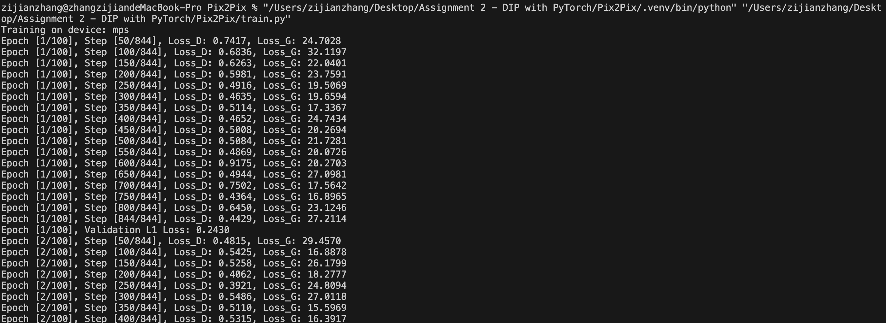
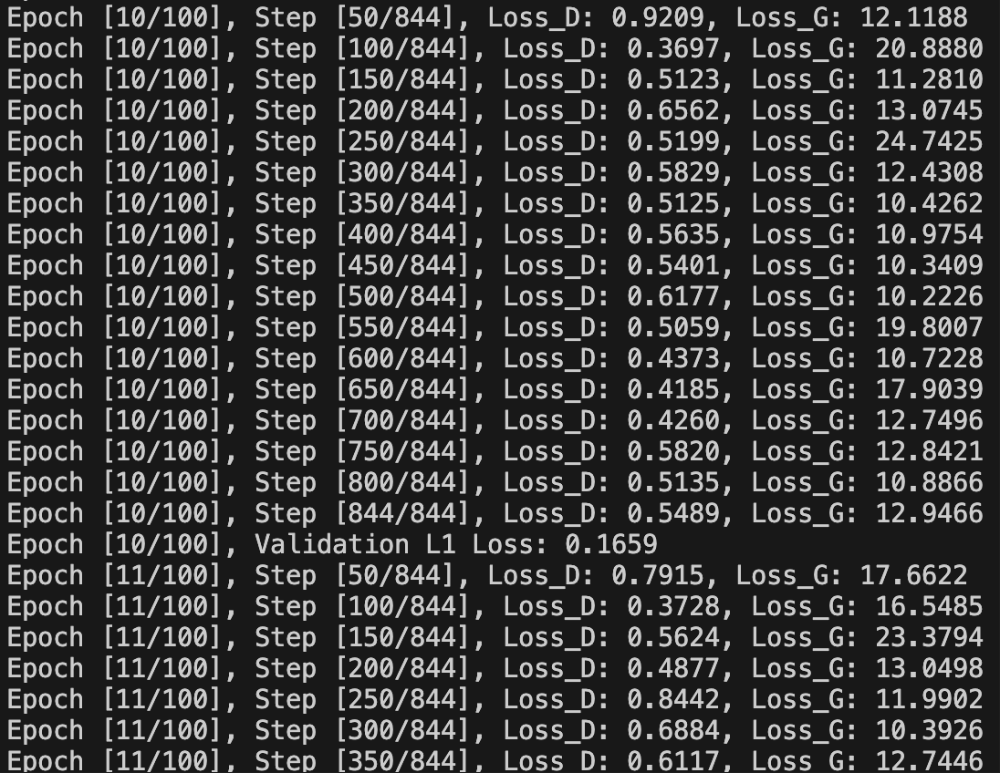

在基于条件生成对抗网络（cGAN）的 Pix2Pix 架构中，模型的训练不再是单一目标函数的最小化，而是生成器（Generator, G）与判别器（Discriminator, D）之间的极小极大博弈。

判别器损失`loss_D` 衡量的是判别器分辨“真实图像”与“生成图像”的能力。它由两部分组成：
* **真实样本损失 (D_real)：** 判别器将真实的建筑外墙图像判定为真的概率误差。
* **伪造样本损失 (D_fake)：** 判别器将生成器画出的假图像判定为假的概率误差。
总的 `loss_D` 通常是这两者的平均值：$Loss\_D = 0.5 \times (D\_real + D\_fake)$。

* **理想状态 (约 0.5 ~ 0.7)：** 在采用二元交叉熵（BCE Loss）或均方误差（MSE Loss）的常规设置中，如果生成器和判别器势均力敌，判别器最终只能靠“瞎猜”（准确率 50%），此时 BCE Loss 的理论均衡点约为 $-\ln(0.5) \approx 0.69$，MSE 均衡点约为 0.5。因此，`loss_D` 在 0.5 附近震荡是非常健康的标志。

生成器损失`loss_G` 是一个联合损失函数，由两部分加权求和而成：
* **对抗损失 (G_GAN)：** 生成器努力让判别器将假图判定为真图的误差。
* **像素级重构损失 (G_L1)：** 生成图像与真实目标图像之间的平均绝对误差（MAE）。在 Pix2Pix 中，为了保证生成的图像既逼真又严格对齐条件输入，L1 损失通常会被赋予一个极大的权重（$\lambda = 100$）。
公式表示为：$Loss\_G = G\_GAN + \lambda \times G\_L1$。

**合理范围与物理意义：**
* **动态变化过程：** 由于包含权重高达 100 的 L1 损失，`loss_G` 在训练初期的绝对数值通常很大（例如 20 到 50 左右）。随着网络逐渐学到建筑物的轮廓和色彩，`loss_G` 会稳步下降。
* **均衡状态：** 当模型收敛时，对抗损失部分（`G_GAN`）通常会在 1.0 到 2.0 之间波动（表示生成器能一定程度上骗过判别器），而加权后的 L1 损失会降到一个平稳的低谷。因此，`loss_G` 最终稳定在一个恒定的区间（具体数值取决于数据集复杂度，通常在个位数到十几之间），只要不再出现断崖式下跌或剧烈飙升，即代表模型已成熟。

最终训练后的`val_loss`值稳定在0.15。最终测试集的代码运行之后结果如下：
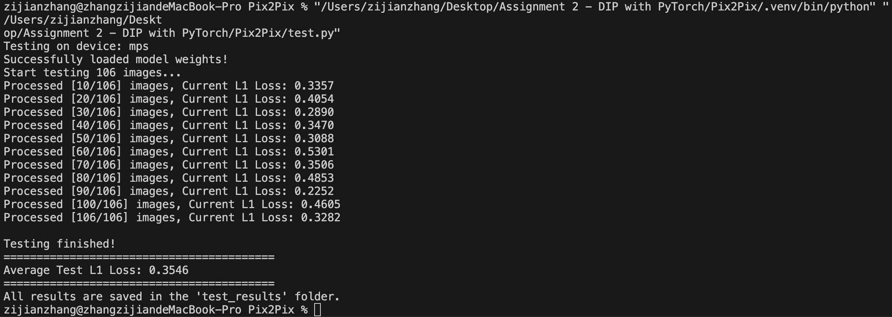

挑选`test_results`文件中的部分结果进行查看，发现训练效果还可以：
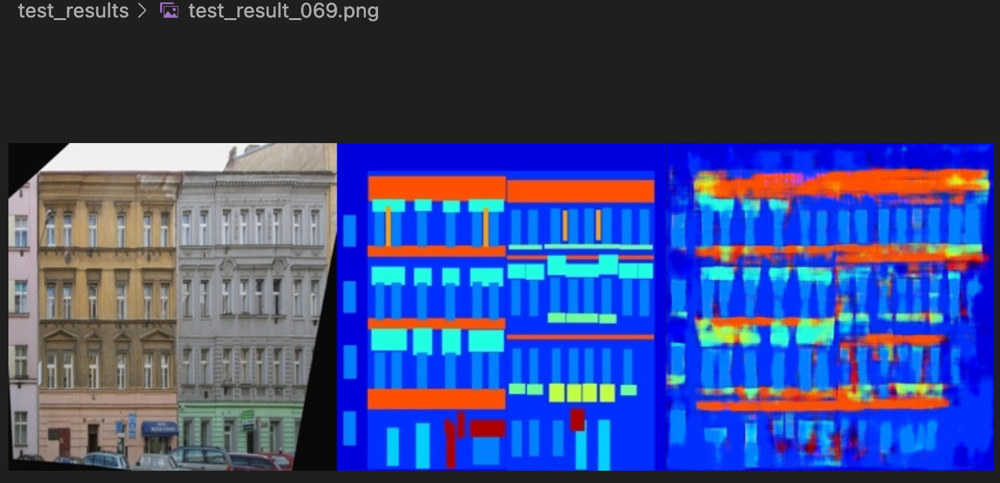
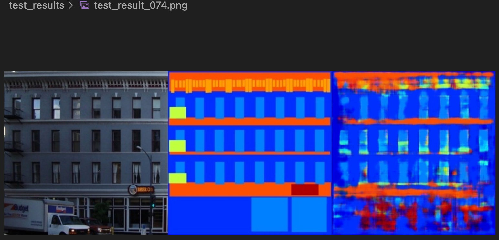
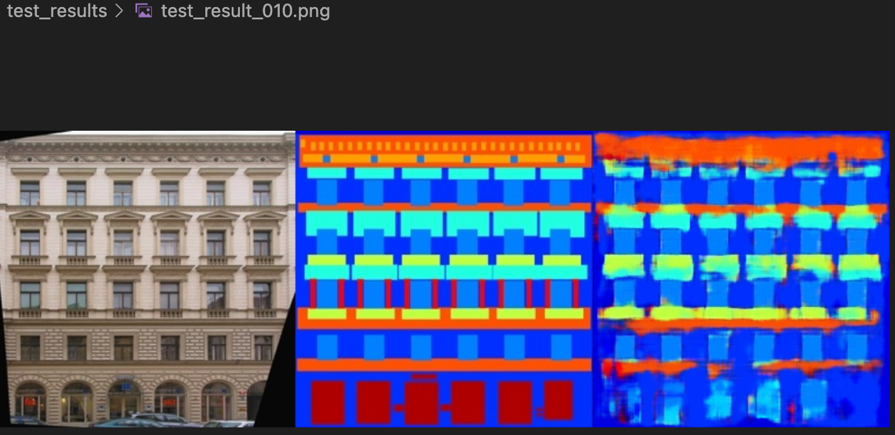
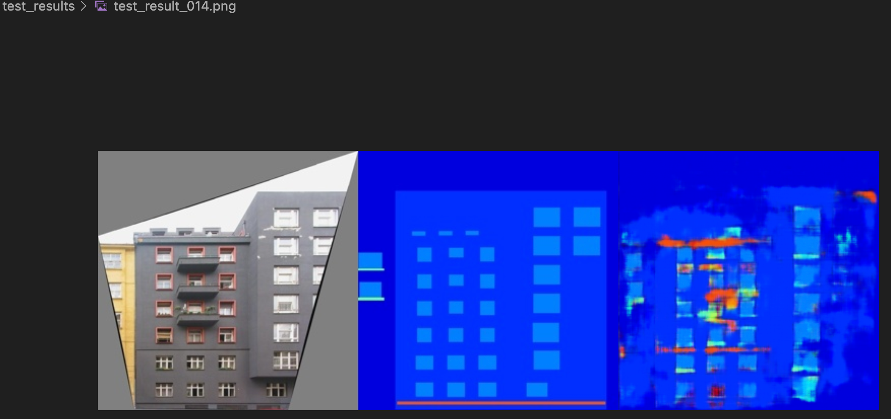
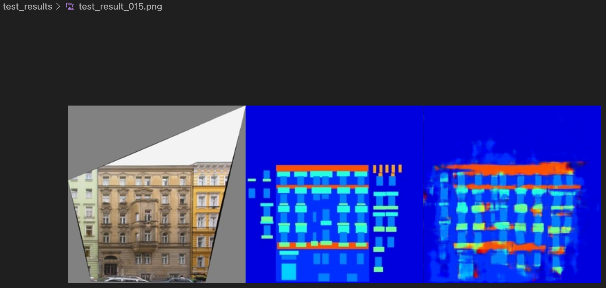
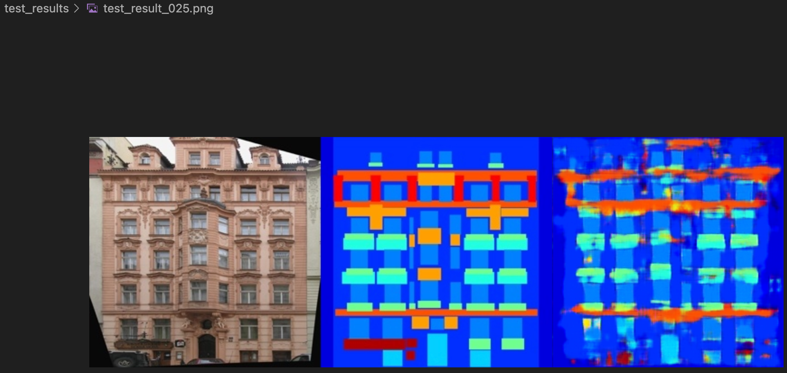

### 2.6 代码上传及补充说明
本项目运行后所有的文件如下图（还有隐藏的.venv文件）：
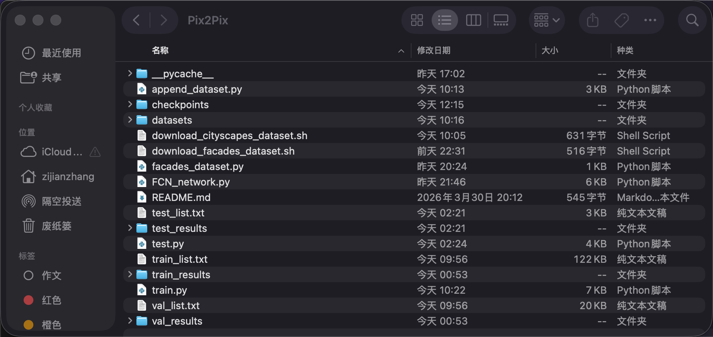
为了上传的方便，只保留了基本的代码，去掉了数据集、训练结果、`checkpoints`文件和虚拟环境文件。

感谢以下三篇论文中提出的算法：[Paper: Image-to-Image Translation with Conditional Adversarial Nets](https://phillipi.github.io/pix2pix/)、[Paper: Fully Convolutional Networks for Semantic Segmentation](https://arxiv.org/abs/1411.4038)和[PyTorch Installation & Docs](https://pytorch.org/).