# Implementation of Digital Image Process(Yudong Guo) Assignment 3 - Bundle Adjustment

**Name:** Zijian Zhang(张子健)

**Student ID:** SA25001083

该仓库包含中国科学技术大学数学科学学院数字图像处理（MATH6420P.01）课程的作业3（Bundle Adjustment）的实现过程以及实验结果。主要实现了使用 PyTorch 实现 Bundle Adjustment 和使用 COLMAP 从多视角图像实现完整的 3D 重建。

## 1. 使用 PyTorch 实现 Bundle Adjustment

光束法平差（Bundle Adjustment）是三维重建（如 SfM）过程中的核心步骤。核心思想是：通过最小化三维点投影到二维图像上的“重投影误差（Reprojection Error）”，来联合优化相机的内外参数以及三维点云的坐标。

经典的 Bundle Adjustment 问题表述为：一个 3D 头部模型的表面上采样了 20000 个 3D 点，并从 50 个不同视角将这些点投影到 2D 图像上，仅根据这些 2D 观测，通过优化恢复出 3D 点坐标、相机参数和焦距。

运行文件`visualize_data.py`，可以了解数据读取和可视化的方式，基本结果如下：
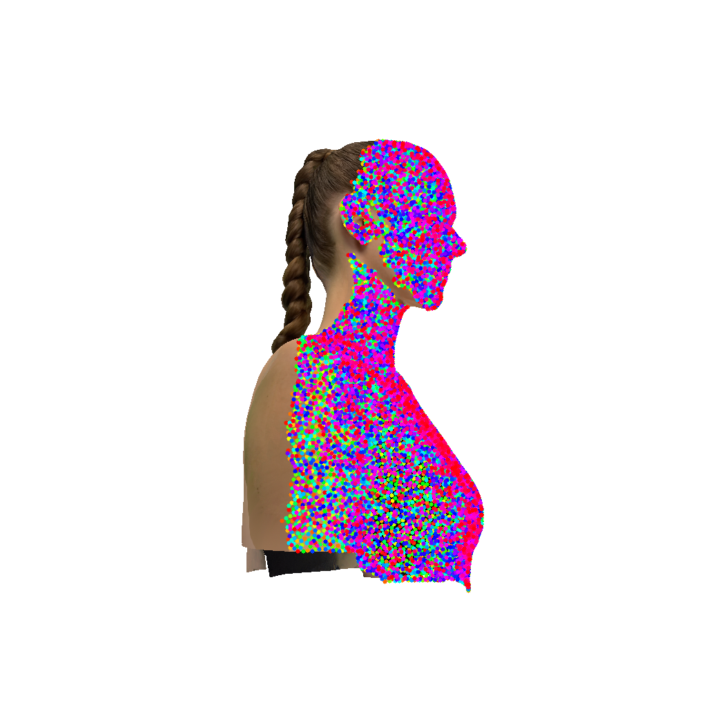
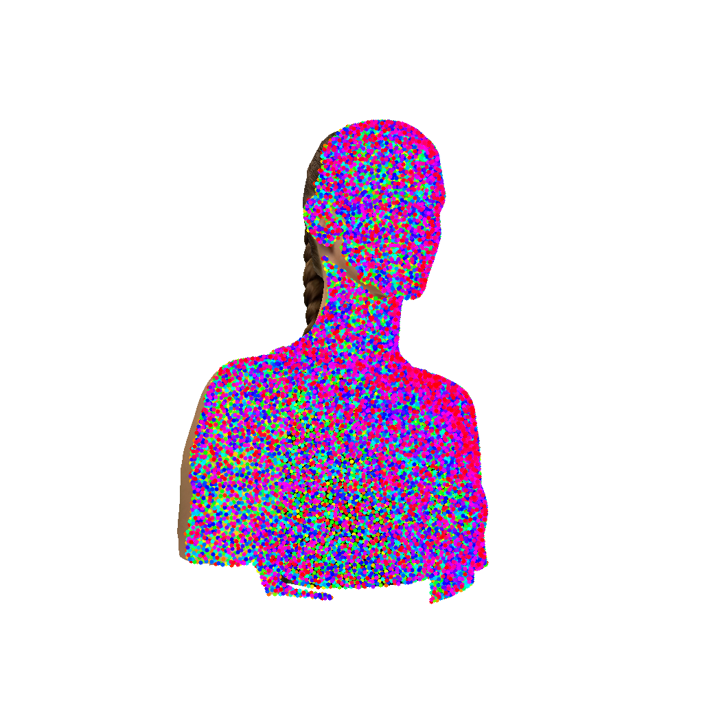
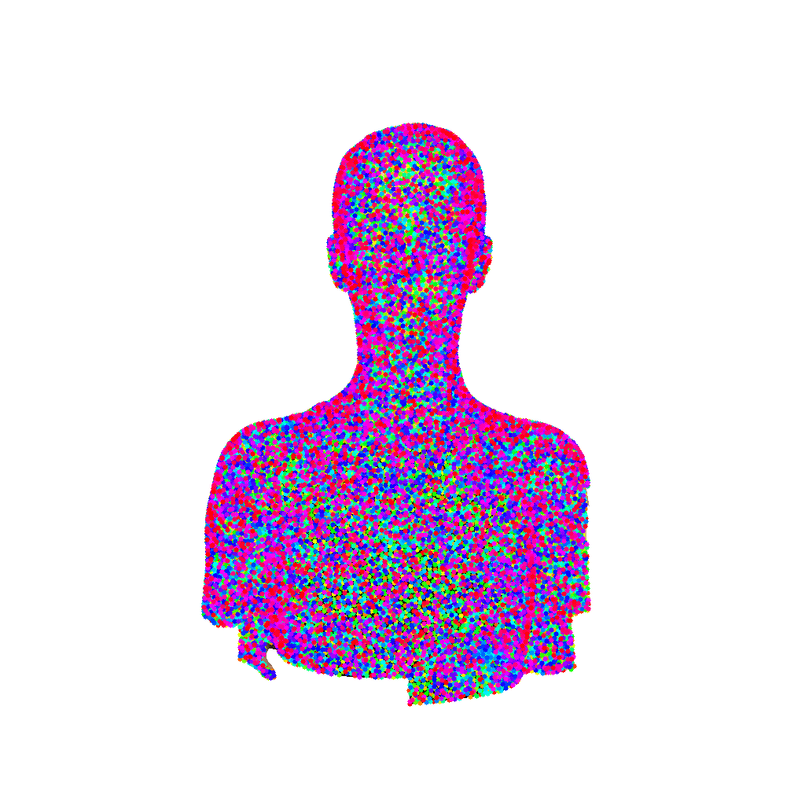
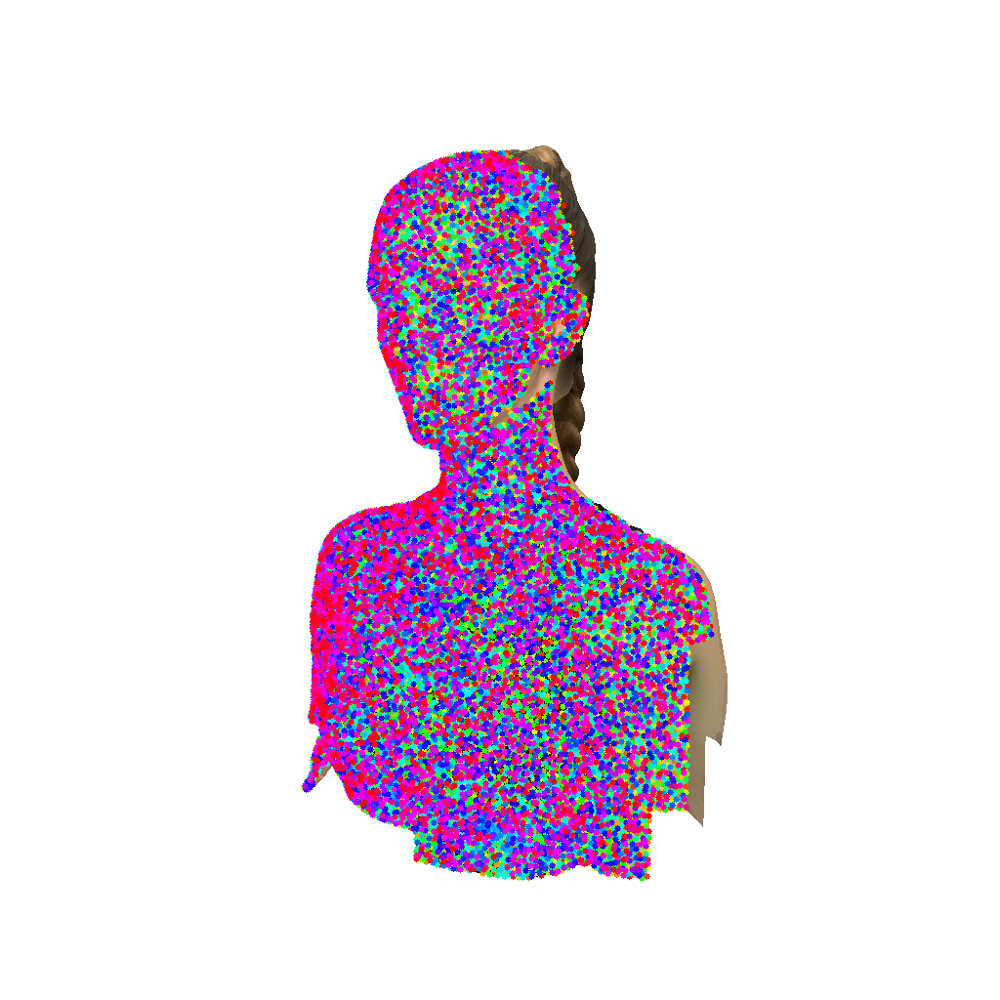
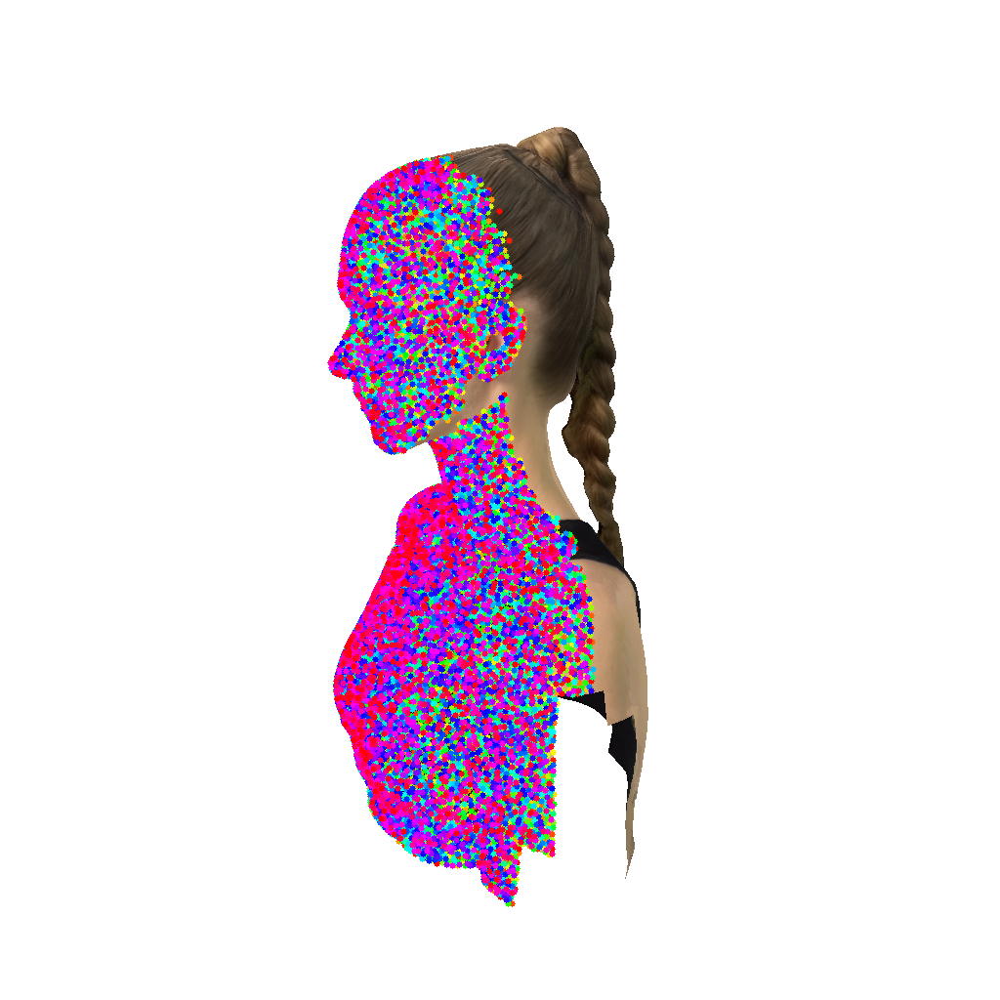

由于本次任务仍然需要使用GPU，所以我把所有的代码都放在Google Colaboratory上运行，运行之后保存为`Bundle Adjustment.ipynb`文件，运行过程中的输出直接保存在记事本中，便于查看。
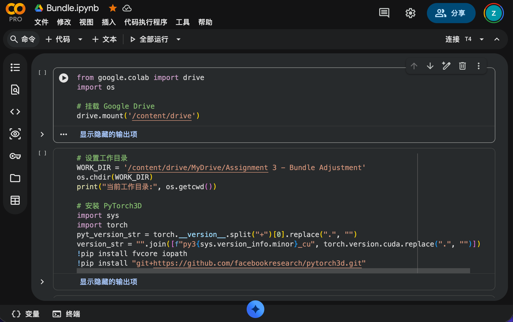
在Task 1 的任务中，PyTorch3D 包的安装过程花了大约36分钟左右（主要卡在了Building wheels for collected packages : pytorch3d这一步，虽然我也不知道为什么），整体代码的运行过程大约只需要15秒：
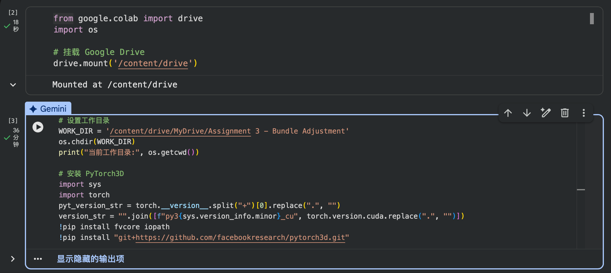
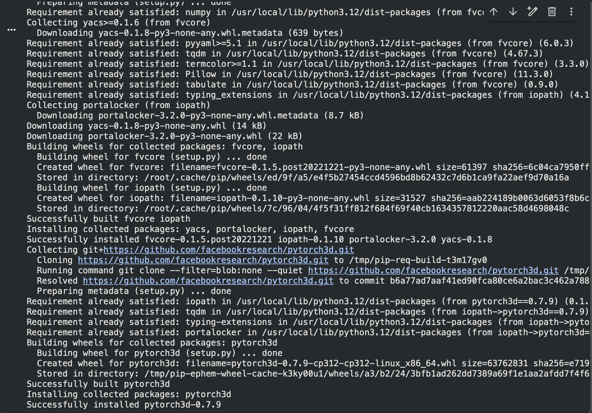

本任务利用深度学习框架 **PyTorch** 强大的自动微分（Autograd）机制和梯度下降优化器（Adam），将 Bundle Adjustment 问题转化为一个类似神经网络训练的过程。

在代码的 `BundleAdjustmentModel` 类中，所有待优化的变量均被声明为 `nn.Parameter`，让 PyTorch 的优化器能够对其进行梯度更新：

1. **3D 点坐标 (3D Points)**：共 $N=20000$ 个点。每个点表示为 $(X, Y, Z)$。
   - *初始化*：在原点附近随机初始化（高斯分布加上缩放）。
2. **相机外参 (Extrinsics)**：共 $V=50$ 个相机视角。外参负责将坐标从世界坐标系变换到相机坐标系。
   - **旋转 (Rotation)**：为了避免直接优化 $3\times3$ 旋转矩阵带来的正交性约束问题，代码采用了 **欧拉角** 也就是 `camera_euler` 来表示，维度为 $(50, 3)$。
   - **平移 (Translation)**：平移向量 `camera_t`，维度为 $(50, 3)$。初始化时在 Z 轴方向设定了一定的偏移（-2.5），以保证 3D 点初始时位于相机前方。
3. **相机内参 (Intrinsics)**：所有相机共享的单一焦距 $f$。
   - *初始化*：假设 60 度视场角 (FoV)，中心点固定在图像中心 $(c_x, c_y) = (512, 512)$。焦距 $f$ 作为标量参数进行优化。

代码中的 `forward` 函数的数学过程分为两步：

首先，利用 `pytorch3d` 提供的 `euler_angles_to_matrix` 函数将欧拉角转换为 $3\times3$ 的旋转矩阵 $R$。
对于第 $i$ 个相机和第 $j$ 个 3D 点，将其从世界坐标系转换为相机坐标系下的点 $P_{cam}$：
$$P_{cam} = R_i \cdot P_{3d, j} + T_i$$
在此过程中，代码使用了批量矩阵乘法 (`torch.baddbmm`) ，利用 T4-GPU 进行并行计算，得到每个点在不同视角下的三维坐标 $(X_c, Y_c, Z_c)$。

接下来，根据相似三角形原理将 3D 点投影到 2D 像素平面。投影公式为：
$$u = -f \cdot \frac{X_c}{Z_c} + c_x$$
$$v = f \cdot \frac{Y_c}{Z_c} + c_y$$
*(公式中 $u$ 前面的负号是针对特定坐标系约定的处理，防止图像出现左右翻转)。*
这两步将初始的或者当前步骤优化出的 3D 点，变为了网络“预测”的二维像素坐标 `preds`。Bundle Adjustment 的目标是让预测的 2D 投影点尽可能贴合实际观测到的 2D 特征点。

代码计算了所有可见点的均方误差（MSE）。假设 $p_{ij}$ 为观测到的 2D 坐标（`obs_2d`），$\hat{p}_{ij}$ 为前向投影出的预测坐标（`preds`），$M_{ij}$ 为该点在当前视角的可见性掩码（`mask`，可见为 1，不可见为 0）。
损失函数（Loss）定义为：
$$Loss = \frac{1}{\sum M_{ij}} \sum_{i=1}^{V} \sum_{j=1}^{N} M_{ij} \left\| \hat{p}_{ij} - p_{ij} \right\|^2$$

在传统的 Bundle Adjustment 中，需要利用雅可比矩阵以及海森矩阵的稀疏性来求解复杂的最小二乘问题。
但在 PyTorch 中使用：
1. `loss.backward()`：自动利用链式法则计算 Loss 对焦距 $f$、欧拉角 $R$、平移 $T$ 以及 3D 点坐标的偏导数。
2. `optimizer.step()`：使用 Adam 优化器，通过梯度下降的方式，以 $lr=0.01$ 的学习率迭代更新所有的参数。

随着迭代的进行，损失值从几万下降到接近 0，此时相机位姿和三维点云的坐标被成功恢复并对齐，最终完成了 2D 到 3D 的结构恢复。
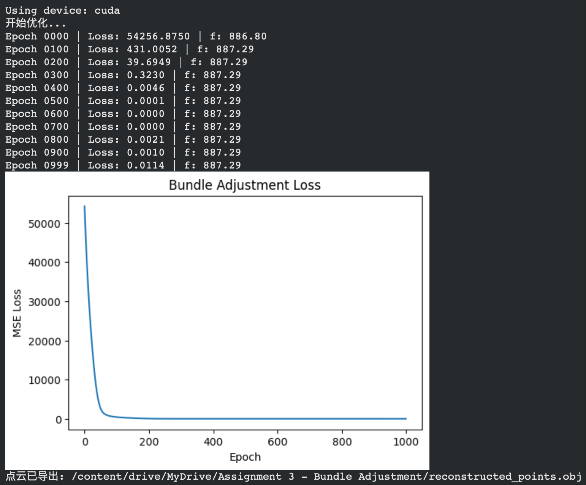
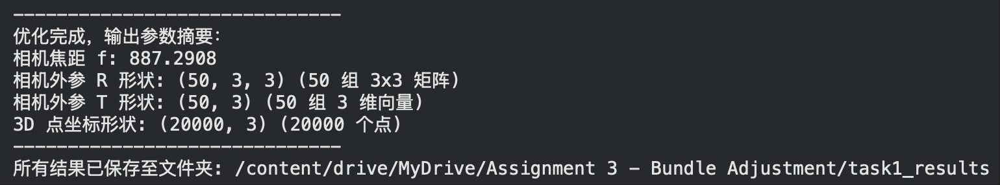
最终得到结果`reconstructed_points.obj`，使用`MeshLab`打开该文件后结果如下：
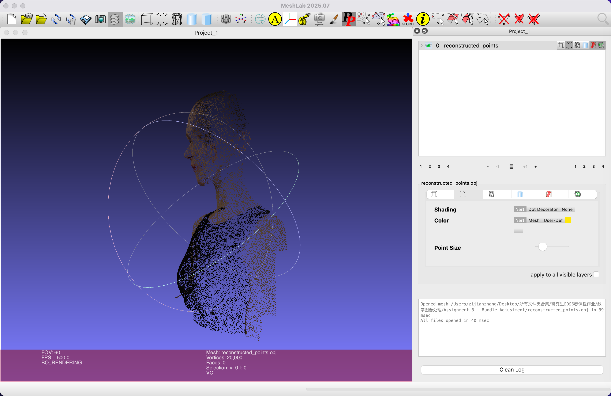
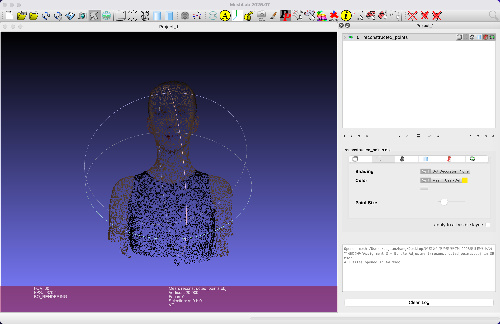
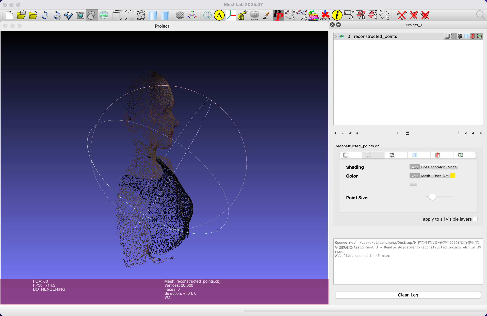

## 2. 使用 COLMAP 从多视角图像实现完整的 3D 重建

### 2.1 任务概述
本部分实验旨在利用标准的开源三维重建框架 **COLMAP**，走通从输入多视角 2D 图像到最终生成高精度 3D 稠密点云的完整过程。COLMAP 已经提供了一套工业级、高度优化的运动恢复结构（SfM）和多视图立体视觉（MVS）算法。

### 2.2 运行环境与配置
为了在 Google Colab这种无 GUI 的服务器上顺利运行 COLMAP，首先需要进行必要的环境配置：
1. **依赖补全**：通过 Conda 安装了缺失的 `faiss-cpu` 库，并手动将其路径添加到 `LD_LIBRARY_PATH` 环境变量中，确保特征匹配模块能够正常调用。
2. **无头模式运行**：设置环境变量 `os.environ["QT_QPA_PLATFORM"] = "offscreen"`。强制 COLMAP 在离屏模式下运行，避免服务器环境下的界面崩溃问题。

### 2.3 COLMAP 重建流水线
整个 3D 重建过程通过 COLMAP 命令行工具依次执行：

#### Step 1: 特征提取 (Feature Extraction)
* **命令**：`colmap feature_extractor`
* **原理**：遍历 `data/images/` 目录下的所有 50 张多视角图像，提取每张图像上的关键点（SIFT 特征）及其描述子，并将这些数据存入 SQLite 数据库文件（`database.db`）中。

#### Step 2: 特征匹配 (Feature Matching)
* **命令**：`colmap exhaustive_matcher` (或相似匹配器)
* **原理**：读取 `database.db` 中的特征描述子，对所有图像对进行两两匹配。这一步建立了不同视角图像之间的几何对应关系，为后续的相机位姿解算提供数据支持。

#### Step 3: 稀疏重建 / 增量式 SfM (Sparse Reconstruction)
* **命令**：`colmap mapper`
* **原理**：执行增量式运动恢复结构（Structure-from-Motion）。算法会首先选择一对匹配良好的图像作为初始化的种子对，然后不断“注册”新的图像（解算 PnP 问题求外参），并通过三角化（Triangulation）生成新的 3D 点。在此过程中，COLMAP 会反复执行全局 Bundle Adjustment 以降低累计误差。
* **输出**：在 `sparse/` 目录下生成相机的内外参矩阵（`cameras.bin`, `images.bin`）以及稀疏点云（`points3D.bin`）。

#### Step 4: 图像去畸变 (Image Undistortion)
* **命令**：`colmap image_undistorter`
* **原理**：为后续的 MVS 稠密重建做准备，MVS 算法要求极线必须是直的。这一步根据 Step 3 优化得到的相机内参（特别是径向和切向畸变系数），对原始图像进行去畸变处理，并统一输出到 `dense/images/` 目录下。

#### Step 5: 稠密重建 / 深度图估计 (Patch Match Stereo)
* **命令**：`colmap patch_match_stereo`
* **原理**：这是计算量最大的一步。COLMAP 基于 PatchMatch 算法进行多视图立体匹配。对于每一张去畸变的图像，它会结合相邻视角的图像，逐像素地估计深度（Depth）和表面法线（Normal）。
* **输出**：在 `dense/stereo/` 目录下生成大量 `.bin` 格式的深度图和法线图。

#### Step 6: 深度图融合 (Stereo Fusion)
* **命令**：`colmap stereo_fusion`
* **原理**：将 Step 5 中生成的所有视角的深度图和法线图投影到同一三维空间中进行一致性检查和融合，剔除错误的噪点，最终提取出连续、密集的点云模型。
* **输出**：生成最终的稠密点云文件 `dense/fused.ply`。

### 2.4 结果分析
实验过程中输出如下，整个 3D 重建过程大约需要15分钟左右时间:
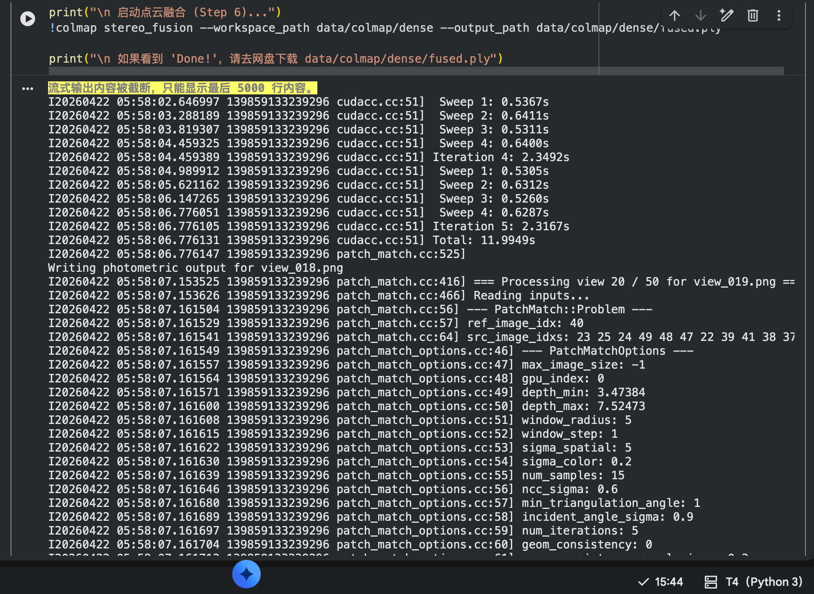
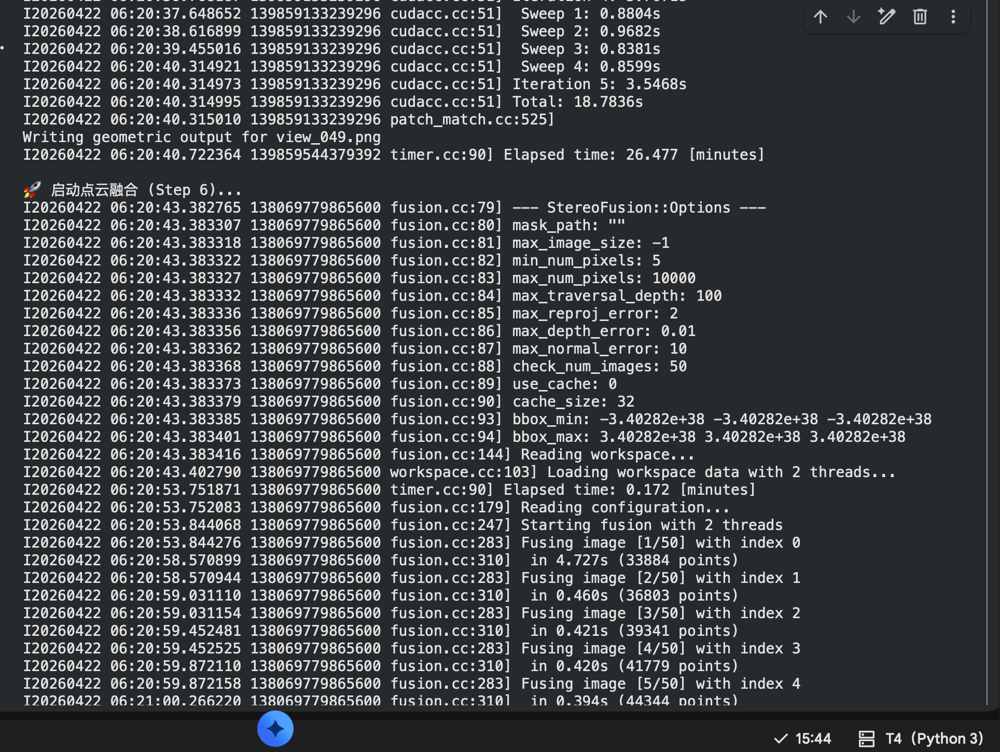

经过上述流水线，成功从给定的图片集中恢复出了场景的高精度几何结构。
最终生成的 `fused.ply` 文件不仅包含了所有的 3D 坐标点 $(X, Y, Z)$，还包含了每个点对应的 RGB 颜色信息和法线向量。该稠密点云可以直接导入 MeshLab 等 3D 软件中进行可视化，结果如下：
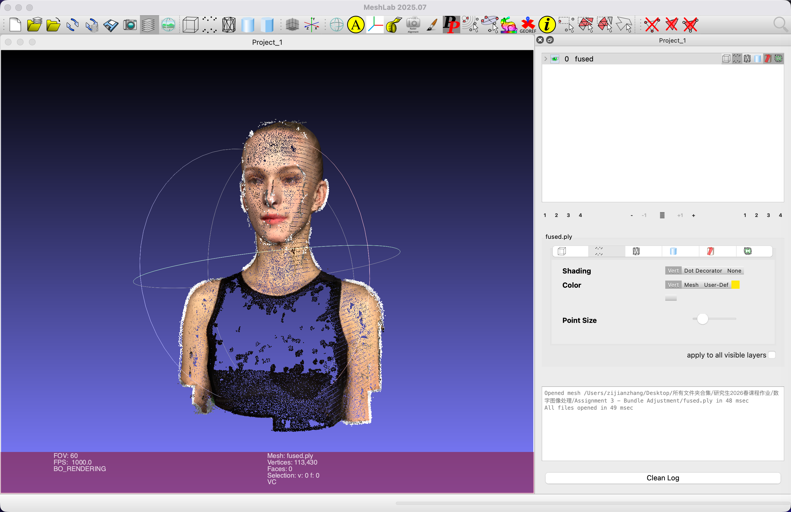
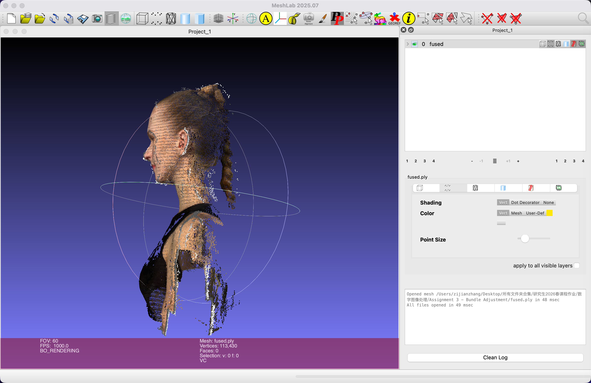
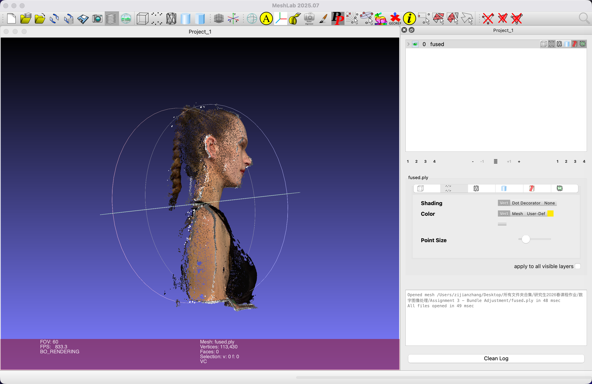
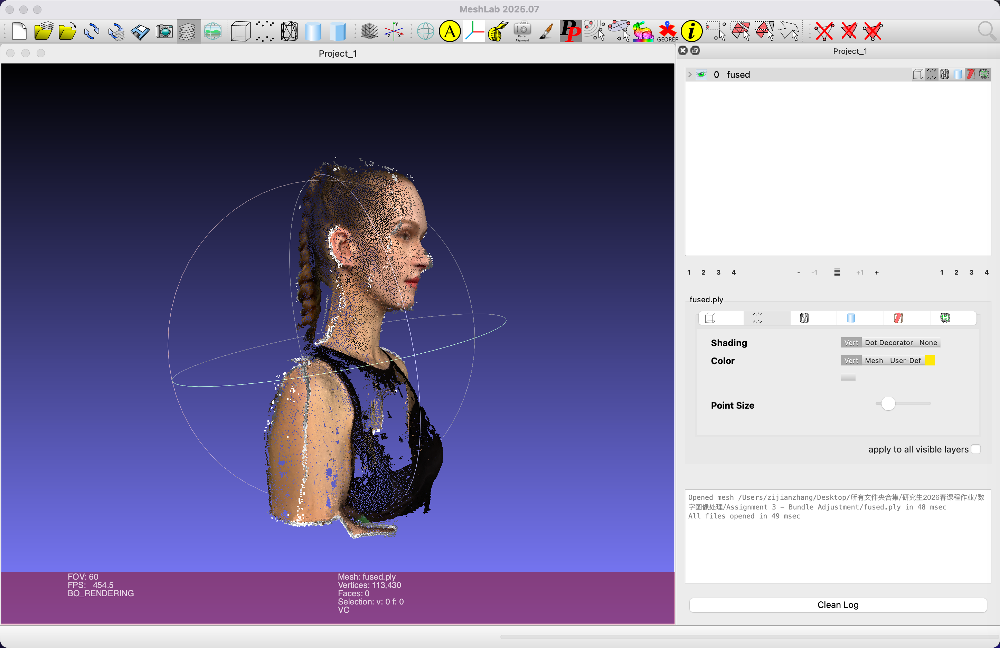

## 3 代码上传及补充说明
本项目运行后文件夹大小如下图（总大小1.74 GB ）：

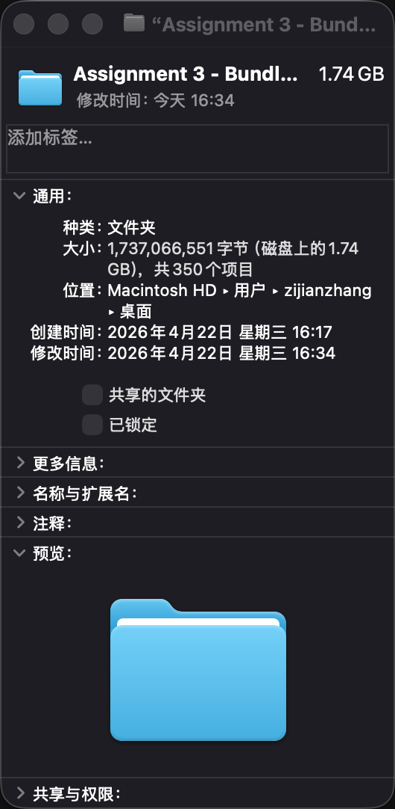

为了上传的方便，只保留了基本的代码和最终结果，去掉了部分中间结果。

