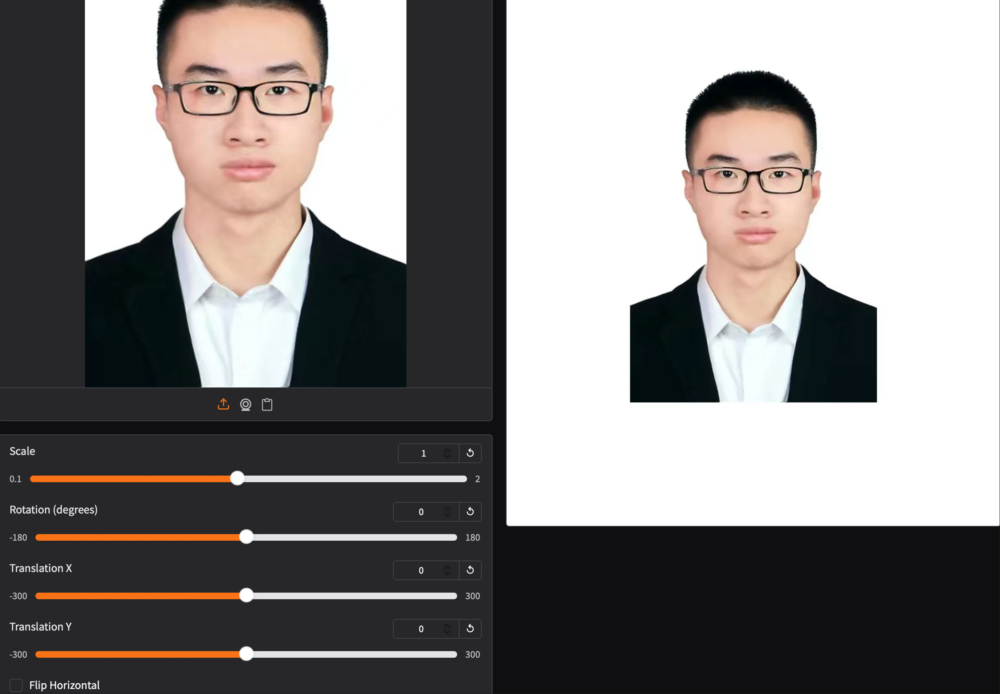
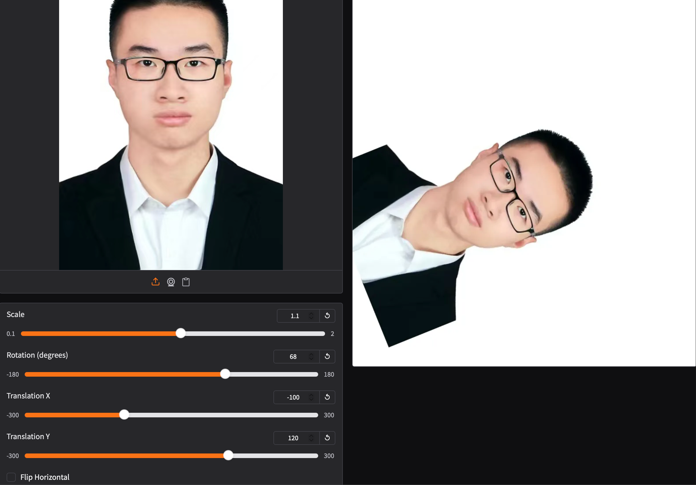
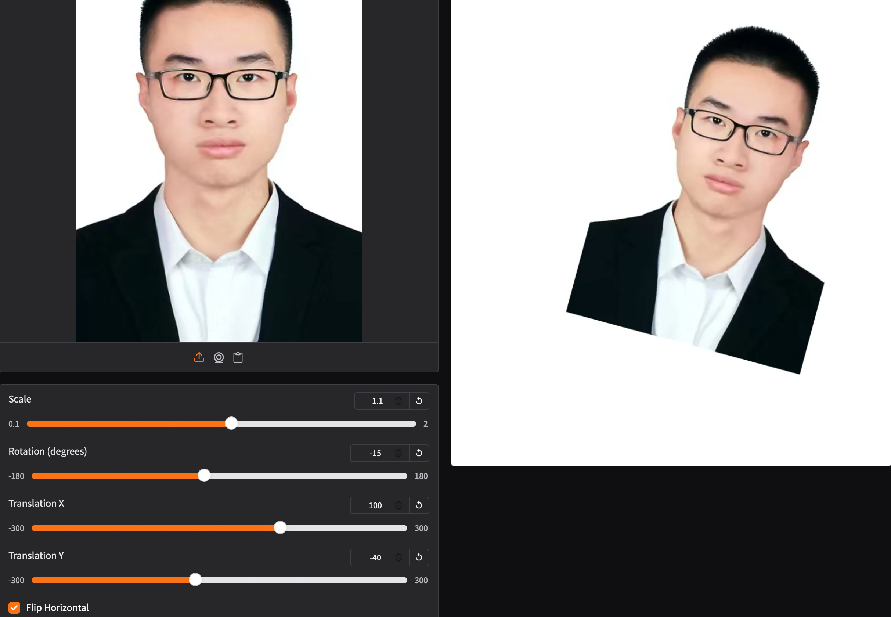
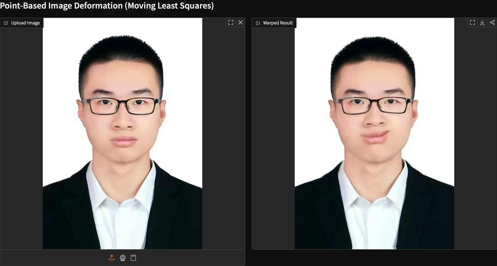
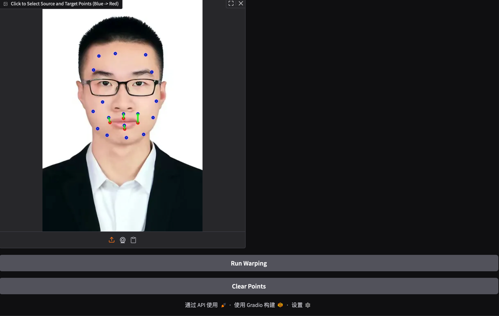

# Implementation of Digital Image Process(Yudong Guo) Assignment 1 - Image Warping

**Name:** Zijian Zhang(张子健)

**Student ID:** SA25001083

This repository contains the implementation of Assignment_1(Image Warping) for Digital Image Processing (MATH6420P.01). The project explores both global image geometric transformations and local point-guided deformations.

## 1. Overview and Methodology

This assignment is divided into two main tasks:

### 1.1 Basic Image Geometric Transformation
I implemented global transformations, including Scaling, Rotation, Translation, and Horizontal Flipping. 
- **Methodology**: The operations are mathematically combined into a single composite 3x3 affine transformation matrix (`M = T_final * F * R_S * T_origin`). 
- **Implementation Details**: To ensure that scaling and rotation feel natural, the image's coordinate origin is temporarily shifted to the image center (`T_origin`) before applying the rotation and scaling (`R_S`), and then shifted back (`T_final`). The final composite matrix is applied using OpenCV's `cv2.warpAffine` function for optimal performance.

### 1.2 Point-Based Image Deformation
I implemented an interactive, local image warping tool based on the **Moving Least Squares (MLS)** algorithm.
- **Methodology**: Specifically, the Affine MLS deformation was utilized. For every pixel in the target image, an optimal local affine transformation is calculated based on its distance to user-defined control points.
- **Implementation Details**: 
  - **Backward Mapping**: Instead of mapping source pixels to the destination (which often causes "holes" or uncolored pixels), I iterate over the destination grid and calculate the corresponding source coordinates to sample colors from.
  - **Vectorization**: The algorithm completely avoids per-pixel `for` loops by leveraging NumPy's matrix operations (vectorization). All coordinates are processed as a large multi-dimensional array, ensuring real-time performance and smooth interaction. OpenCV's `cv2.remap` is then used for sub-pixel bilinear interpolation.

## 2. Requirements

To install the required dependencies:

```bash
python -m pip install -r requirements.txt
```

## 3. Running

To run basic transformation, run:

```basic
python run_global_transform.py
```

To run point guided transformation, run:

```point
python run_point_transform.py
```

## 4. Results
### Parameter Controls and Descriptions

The Gradio web interface provides several interactive controls that allow users to manipulate the global geometric transformations of the uploaded image in real-time. Each parameter modifies a specific component of the composite 3x3 affine transformation matrix.

* **Scale**: This slider controls the uniform scaling factor applied to the image. 
  * **Range**: 0.1 to 2.0 (default is 1.0). 
  * **Effect**: Values greater than 1.0 enlarge the image, while values between 0.1 and 1.0 shrink it. Because the origin is temporarily shifted to the image center during calculation, the scaling correctly expands or contracts from the geometric center rather than the top-left corner.

* **Rotation (degrees)**: This slider controls the rotation angle of the image.
  * **Range**: -180 to 180 degrees (default is 0).
  * **Effect**: A positive value rotates the image clockwise, and a negative value rotates it counter-clockwise. Similar to scaling, this transformation is applied around the geometric center of the padded image.

* **Translation X**: This slider controls the horizontal displacement of the image.
  * **Range**: -300 to 300 pixels (default is 0).
  * **Effect**: Modifies the horizontal offset in the final translation matrix. A positive value shifts the image to the right, while a negative value shifts it to the left along the X-axis.

* **Translation Y**: This slider controls the vertical displacement of the image.
  * **Range**: -300 to 300 pixels (default is 0).
  * **Effect**: Modifies the vertical offset in the final translation matrix. A positive value shifts the image downward, while a negative value shifts it upward along the Y-axis.

* **Flip Horizontal**: This checkbox acts as a boolean toggle for image mirroring.
  * **Effect**: When activated, it introduces a reflection matrix where the X-axis multiplier becomes -1. This mirrors the image horizontally across its central vertical axis. 

### Basic Transformation





### Point Guided Deformation:



## 5. Acknowledgement

> Thanks for the algorithms proposed by [Image Deformation Using Moving Least Squares](https://people.engr.tamu.edu/schaefer/research/mls.pdf).